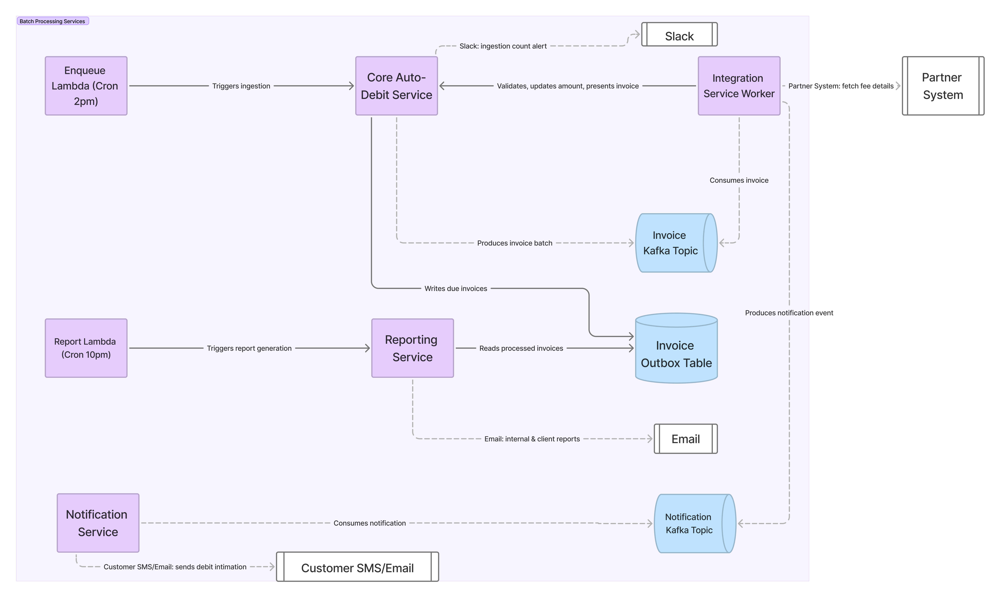

> **TL;DR:**
> How an asynchronous, stateful workflow supported 50K–60K invoice processing per day across roughly 400 partner systems.

## The problem

A consumer sets up a recurring debit mandate (NACH or UPI) against a fee due amount shown at the time of setup.
That amount is not guaranteed to stay correct until the actual debit date, because the source of truth, the partner's own system (ERP/Inhouse management system) can change it:

- a cash payment done reduces the balance amount to be collected
- a previously applied discount gets reverted, increasing the amount due
- a new discount gets applied, decreases the due amount
- the due date itself gets moved to future date

Debiting a stale amount has real financial consequences. A wrong debit can result in a bounce and carry penalty charges for the end customer. So the amount presented for debit has to reflect the partner's current state, not the state at mandate-setup time.

**Why integrations, not just manual updates?**

The alternative, partners bulk-upload updated dues once a day, creates a single point of failure and forces the partner's system into a freeze window until the upload is processed.
That doesn't scale across partners with different operational rhythms, and it puts an availability constraint on someone else's system, which we don't control.

Instead, we fetch the latest details directly from each partner system, reconcile the delta against what's currently recorded, and adjust before presenting the invoice for debit.

**Why the 4 hour window specifically?**

- All due invoices needs to be processed in a window of approx 4 hours.
- Many partners run their own updates (cash collection entries, discount changes) in the first half of the day. Fetching earlier risks pulling pre-update, stale data.
- Once an invoice is presented, we owe the customer a debit intimation notice. We don't want that notice going out late in the evening.

---

## Scale and shape of the problem

- **Volume is spiky, not steady.** Daily invoice counts range from ~1,000 to ~60,000, depending on the day of month and partner systems.
- **Partner heterogeneity.** Each partner runs its own tech stack, with its own release cycles, a partner-side fix or change can take weeks to months to ship. Partner team competence varies widely - some are well-staffed engineering teams, others have outsourced, slow-to-respond vendors.
- **Latency variance per partner is extreme** — anywhere from a few milliseconds to 60+ seconds per request, and this is _unpredictable_ in advance.
- **Shared infrastructure contention.** This pipeline doesn't run in isolation. At the same time, the same core services are handling inbound webhooks from partners, outbound webhook dispatch to partners, high-volume push API traffic, and internal bulk uploads/report downloads. A spike in any of these can degrade the pull-and-present flow's throughput, and vice versa.
- **No safe prefetch/cache.** We can't fetch once and cache for the day - that reintroduces the staleness problem we're solving for. Every invoice needs a fresh fetch within the window.
- **Dual reporting requirement.** After processing, two different reports are generated: an internal report for ops/follow-up, and an external report for subscribed clients.

The core tension: a hard 4-hour window, partner latency we don't control, volume that swings 60x day-to-day, and shared infra that's busy with other traffic - all while correctness failures have direct financial consequences for end users.

---

## High-level architecture

### Stage 1 — Enqueue due invoices


flowchart TD
subgraph Enqueue["Enqueue Due Invoices"]
A[Cron @ 2pm] --> B[Lambda trigger]
B --> C[Core Auto-Debit Service]
C --> D[Async task: fetch all due invoices]
D --> E[(Outbox table)]
D --> F[Enqueue to Kafka in batches]
F --> G[Slack alert: ingestion count]
end


A 2pm cron triggers a Lambda, which hits the core auto-debit service. The core service kicks off an async task (Celery) that fetches all invoices due, writes them to a table using the **transactional outbox pattern**, and enqueues them to Kafka in batches sized to the day's volume. A Slack alert confirms the trigger fired and reports the invoice count for the day - this gives an early signal if current days volume looks abnormal before any processing starts. We can also have a alert to get the due invoice counts for next few days, so that we can plan for any infra changes needed.

### Stage 2 — Process enqueued invoices


flowchart TD
subgraph Process["Process enqueued invoices"]
H[Integration Service Worker] --> I{Invoice still in valid state?}
I -- no --> Skip[Skip / mark invalid]
I -- yes --> J[Fetch latest details from partner API]
J --> K[Diff: compute required update]
K --> L[Update core service with new amount/date]
L --> M{Still in valid state?}
M -- no --> Skip
M -- yes --> N[Present invoice for debit]
N --> O[Enqueue customer notification]
end


Integration service workers consume from Kafka and process invoices one at a time:

1. Check the invoice is still in a valid state (guards against races with other flows touching the same invoice).
2. Fetch the latest amount/due-date details from the partner system over HTTP.
3. Diff against current state to determine what update is needed.
4. Update the core services over internal HTTP calls.
5. Re-check valid state (the fetch + diff + update round-trip takes time, state may have changed).
6. Present the invoice for debit.
7. Enqueue a customer notification about the upcoming debit.

### Stage 3 — Generate reports


flowchart TD
subgraph Report["Generate reports (10pm cron)"]
P[Cron @ 10pm] --> Q[Lambda trigger]
Q --> R[Integration Service]
R --> S[Read outbox table]
S --> T[Generate + email internal report]
S --> U[Generate + email external client report]
end


A 10pm cron triggers report generation, reading from the same outbox table populated in Stage 1 - so the report reflects exactly what was ingested and processed, not a live re-query that could double-count or miss records.

---

## Integration Service

- Integration Service acts like an orchestrator, handling fetching data from external partner systems, figuring out if an updated is needed, changes to be done and making HTTP requests to internal services to update the new state and finally presenting the invoice for debit.

- Integrations workers are running 24/7, even though we only use then for few hours every day. We didn't need to do worker auto scaling, when needed for few days a year, we could monitor and increase the resource on specific days as per the load.

- Each msg can take upto ~5s to be processed successfully and multiple calls over HTTP are done (external and internal calls) in processing a single msg.

- For each partner, we could have a configurable timeouts in integration service.

- For each partner we could have configurable number of retries in case of failures while processing the invoice.

- At integration service, we have a default way of processing of invoices, per partners we could have custom implementations using the template method pattern.

- Duplicate invoice processing in avoided by having a composite key in the invoice outbox table before ingestion and invoice present call is idempotent and would raise error if already presented.

- Duplicate customer notification is handled by notification service.

- Deployments needs to be managed to avoid disruption during this workflow.

## Capacity planning: how many workers do we need?



The 2pm–6pm window is fixed, so worker count is a direct function of per-invoice processing time and total volume for the day.

**Assumptions:**

- Processing window: 4 hours
- Worst-case per-invoice processing time: ~5s

**Per-worker throughput:**

$$
\text{Messages per worker} = \frac{4 \times 60 \times 60}{5} = \frac{14{,}400}{5} \approx 2{,}900 \text{ msgs}
$$

**Workers needed for peak volume (~50k invoices):**

$$
\text{Workers required} = \frac{50{,}000}{2{,}900} \approx 17.2 \Rightarrow \textbf{18 workers}
$$

So at the observed worst-case per-invoice latency, roughly 18 concurrent workers are needed to clear a 50k-invoice day within the 4-hour window.

| Daily invoice volume | Workers needed (at 2,900 msgs/worker) |
| -------------------- | ------------------------------------- |
| 1,000                | 1                                     |
| 10,000               | 4                                     |
| 25,000               | 9                                     |
| 50,000               | 18                                    |
| 60,000               | 21                                    |

---

## Observability

- Grafana dashboards to monitor the service healths / resource consumption.
  - For integration service, external partner call latency, MSK health

- Redash dashboards to query the outbox table to check for invoice state and counts.
