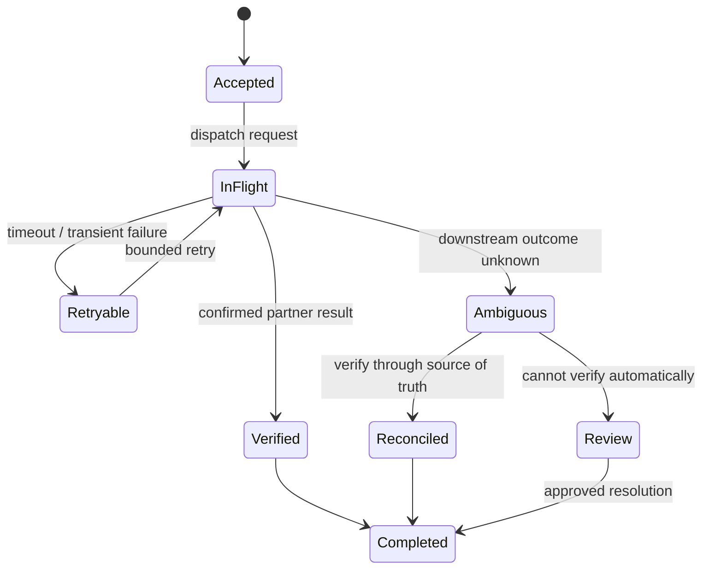

> **TL;DR:** External APIs turn every business workflow into a distributed system. Preserve durable state, isolate dependencies, and make an ambiguous timeout a recoverable business state—not an invitation to guess.

Partner integrations are distributed systems at their messiest: latency varies, schemas drift, and a timeout rarely tells you whether an operation happened. The answer is not more retries. It is an explicit operational contract.

## Model a transaction as a state machine

Persist each business transition before handing work to the next stage. A worker should be able to restart and answer three questions: what is the current state, what was the last verified result, and what remains safe to retry?

This model is more useful than a collection of status flags because it names uncertainty. A timeout can mean the request never left the client, the remote service never received it, or the remote service acted but the response was lost. Treating all three as “retry” is how duplicate actions and reconciliation problems begin.

## Build a recovery path before the happy path is busy

A retry policy is not a recovery strategy by itself. The strategy needs an idempotency key or a comparable business identifier, a record of each delivery attempt, and a way to reconcile an ambiguous outcome against a source of truth. The exact implementation differs by partner, but the operating principle is stable: only retry automatically when the next attempt is known to be safe.

The workflow state should be durable before a worker hands work to the next stage. That gives a restarted worker the same facts as the one that originally issued the request. It also gives support and on-call engineers an inspectable timeline instead of a log-search exercise.

## Separate partner failure from platform failure

Queue isolation keeps one slow or failing integration from consuming all worker capacity. Give every partner a bounded concurrency budget, a timeout policy, and observable error categories. This makes scaling deliberate rather than reactive.

Isolation is especially important when the platform has a mix of responsive and slow dependencies. Without it, the healthy partners pay the cost of the unhealthy one: worker pools fill with long-lived requests, queues age together, and the only available mitigation is often a broad throttling change. Partner- or workload-level boundaries preserve choices during an incident.

## Treat timeouts as evidence, not verdicts

The most dangerous production condition is an outcome that is unknown but looks like a simple failure. For financially meaningful work, a request timeout should produce an explicit state that triggers a defined action: query a partner status endpoint, wait for a webhook, reconcile against a ledger, or route the item for review. The action should be visible in dashboards and runbooks.

This is the distinction between reliability and mere availability. A system that retries everything may appear highly available while quietly creating work that cannot be explained. A reliable system makes uncertainty legible and limits the blast radius until it can be resolved.

## Treat correctness as a first-class latency requirement

For financial workflows, returning quickly with an unverified amount is not a success. Design idempotency keys, reconciliation paths, and audit records early. They are the tools that let an on-call engineer resolve ambiguity without replaying the whole world.

## Make the system legible

Dashboards should show backlog age, success rate, retry distribution, dependency latency, and business outcomes—not only CPU and error rate. The best integration platform is one an engineer can understand during an incident.

At a minimum, I want to see the oldest item in each queue, the retry age distribution, partner-level saturation, terminal-failure counts, and the number of items in an ambiguous or manual-review state. Those are the signals that answer the useful questions: can we still meet the operating window, which dependency needs attention, and what customer or financial action is at risk?

## The standard I use

An integration is ready to operate when its contract includes a timeout policy, a concurrency boundary, a retry classification, an idempotency or reconciliation mechanism, and an owner who can explain the failure path. The request itself may be simple. The engineering is in making the resulting workflow safe when the network behaves like a network.
