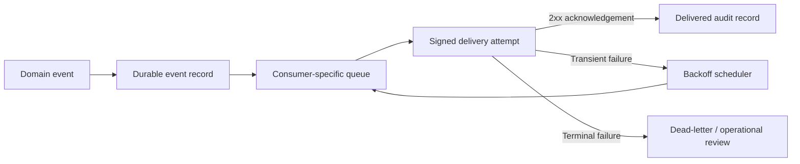

> **TL;DR:** A trustworthy webhook platform separates event creation from delivery, bounds retries, isolates consumers, and preserves enough history for both teams to resolve a failure without guessing.

A webhook endpoint is simple; a webhook platform is an agreement with another engineering team. Consumers expect timely delivery, useful recovery behaviour, and a way to answer what happened.

## Preserve the event, then deliver it

Store an immutable event record before delivery. Delivery attempts should reference that record, carry an idempotency identifier, and be independently inspectable. This separates event creation from delivery success.

The durable record is the key boundary. It means that a successful business action does not depend on an external endpoint being reachable at that moment. It also means a delivery can be replayed from a known event rather than reconstructed from application logs.

## Use bounded, intentional retries

Retries need exponential backoff, a maximum attempt policy, and a terminal state that creates an actionable operational queue. Blind retries amplify downstream incidents; classified retries create recovery options.

Not every non-2xx result is equal. A connection failure, a `429`, a `5xx`, a malformed endpoint, and a signature rejection each point to a different owner and a different safe action. Delivery platforms should classify these outcomes before deciding whether to retry. That makes the retry stream a controlled recovery mechanism rather than a background source of load.

Backoff also needs an operating boundary. A healthy platform can describe the oldest pending event, the next scheduled attempt, the consumer experiencing the failure, and the point at which human intervention is required. Those are the operational numbers to define with the team before publishing a retry policy.

## Design for unequal consumers

Prioritisation and queue isolation prevent a noisy consumer from delaying time-sensitive events. Track delivery age per consumer and expose enough audit history for support and partner engineers to diagnose failures together.

The unit of isolation is usually a consumer or a class of work, not the entire platform. A high-volume consumer that is slow to acknowledge should have its own concurrency and queue budget. Time-sensitive events can then make progress without being stuck behind a backlog that belongs to a different integration.

Priorities must be explained in business language. For example, a state change that unblocks a payment workflow may have a stronger delivery target than an informational notification. The priority policy should be observable, documented, and revisited when new event types are introduced.

## Operate the contract

Document payload versions, signing, retry semantics, and status codes. Instrument delivery latency, endpoint response classes, and dead-letter volume. A reliable webhook platform turns an integration boundary into a capability teams can depend on.

## Make support a first-class consumer

The platform is only as useful as its failure story. Support and partner engineers should be able to locate an event by identifier, see every attempt, understand the current state, and know the next permitted action. A delivery audit trail turns “we did not receive it” from an argument into a jointly inspectable timeline.

The same data supports incident response: delivery age, error-class distribution, queued events by consumer, and dead-letter growth tell an on-call engineer whether the incident is local, partner-specific, or systemic. The goal is not only to deliver more events. It is to give teams confidence that important events will either arrive or fail in a way they can act on.
